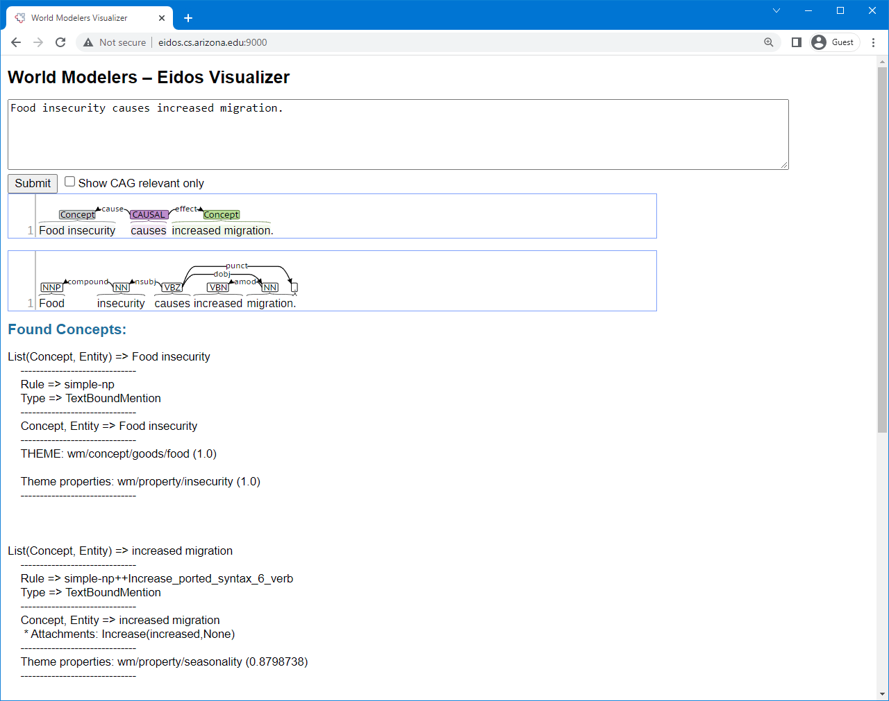
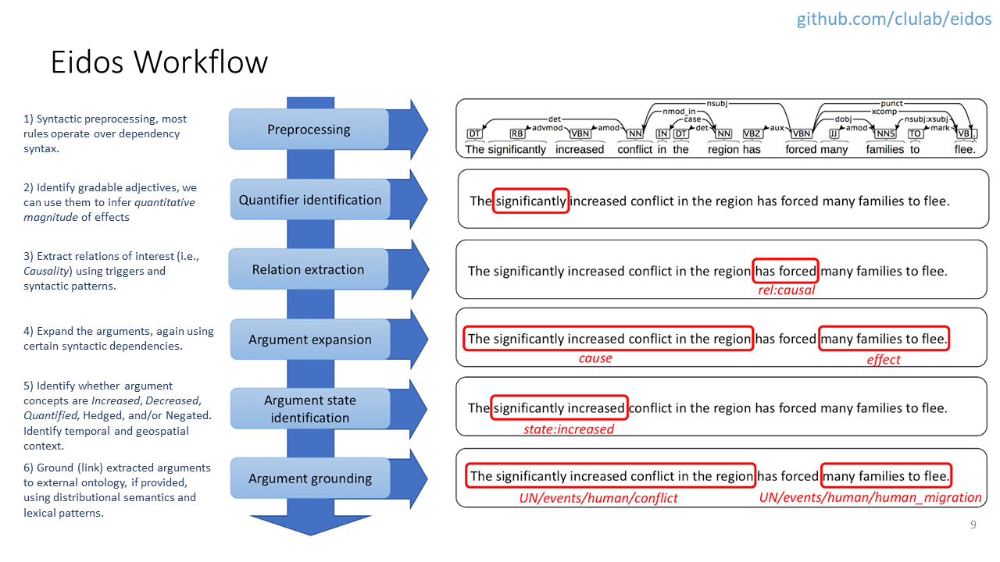

# Eidos

[Eidos](https://github.com/clulab/eidos) is a machine reading system developed by the [CLU Lab](http://clulab.org) at the [University of Arizona](http://www.arizona.edu) for the [World Modelers](https://www.darpa.mil/program/world-modelers) (WM) program.  It extracts entities (e.g, "food security"), arguments (increase, decrease, quantification, etc.), and events (most significantly, directed, causal events like "Food insecurity causes increased migration.") from unstructured text and grounds them to [ontologies](https://github.com/WorldModelers/Ontologies) developed for the program.  These extractions go on to form nodes and edges in causal analysis graphs (CAGs) processed by other WM tools described on these pages.  Eidos participates with the other tools in a number of [workflows](./eidos_workflows.html), but the simplest way to try it out is via the [visualizer](http://eidos.cs.arizona.edu:9000/) pictured below.

  

Key features of Eidos include the following:

1. It reads for causation in the open-domain in which "Anything can cause anything", including things you or it has never heard of before.
2. It is rule-based, using the [Odin](https://clulab.github.io/processors/odin.html) information extraction framework, making it easy to interpret, modify, and maintain.
3. Its reading is decoupled from ontologies.  After reading, it can ground to any number of them.
4. It follows a top-down approach, keeping close to the text with these steps:
    1. Find relations of interest (i.e., causal ones triggered by "due to", "facilitates", "because", etc.).
    2. Extract participating concepts (e.g., "food insecurity", "increased migration", or "many families to flee").
    3. Ground (meaning to link or match) them to a taxonomy for downstream use.

The approach is illustrated in this graphic:

  

