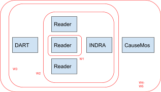

# World Modelers WG1 document management/reading/assembly/HMI usage templates

This document catalogues what usage modes should be explicitly supported and documented as workflow templates (W1-5 below). These templates don’t cover every conceivable combination and usage mode, rather, the goal is to focus on ones that are likely to be useful for users. Customizations to the ontology and the usage of associated tools cuts across all of these workflows, and can in principle be relevant for any of them, suggesting that they should be documented separately.

  

# Documentation by Workflow

## W1. Reading only
In this usage mode the user is looking to just perform NLP on a set of input documents they manually compiled and brought into a form that one of the reading systems takes as input (e.g., in the case of Eidos, a folder with txt files). They are not looking for either document management through DART or multi-reader integration/assembly through INDRA, but rather, are responsible for their own downstream processing of reader outputs and derived analysis.

Systems used:
  * Readers ([Eidos](eidos.html#W1), [HUME](W1), [Sofia](W1))

## W2. Reading + integration/assembly
In this usage mode, the user is looking to perform NLP on a set of input documents and then INDRA to benefit from some combination of (i) multi-reader integration (ii) assembly functionalities (iii) standardized representation of reader outputs (iv) standard programmatic APIs for interfacing with readers and their outputs. The user in this mode is again responsible for document gathering and preparing inputs for reading but may use INDRA as a wrapper around calling one or more reading systems. The user is expected to then either use INDRA Statements as objects or in a JSON-serialized form for their own downstream analysis.

Systems used:
  * Readers ([Eidos](eidos.html#W2), [HUME](W2), [Sofia](W2))
  * Integration/assembly ([INDRA](W2))

## W3. Document management + reading + integration/assembly
In this usage mode the user aims to use DART for managing documents and using a standardized interface between DART and the reading systems to avoid having to manually prepare input files for readers. The rest of the workflow follows W2 in that INDRA is used for integration. The user then takes INDRA Statements for further downstream analysis.

Systems used:
  * Document management ([DART](W3))
  * Readers ([Eidos](eidos.html#W3), [HUME](W3), [Sofia](W3))
  * Integration/assembly ([INDRA](W3))

## W4. Document management + reading + integration/assembly + HMI
In this usage mode the user goes beyond W2 or W3 by loading INDRA outputs into CauseMos to explore, curate, and derive models from the assembled causal information. However, in this usage mode, the user is not expecting a service architecture to support incremental reading/assembly during runtime. The usage of DART is technically not required for W4 but it allows linking back to documents and examining their metadata which is advantageous. This is like a one-time run of W2/W3 and then loading results into the HMI as a “static” corpus. So the focus here is on the HMI irrespective of the pipeline feeding into it.

Systems used:
  * Document management ([DART](W4))
  * Readers ([Eidos](eidos.html#W4), [HUME](W4), [Sofia](W4))
  * Integration/assembly ([INDRA](W4))
  * HMI ([CauseMos](W4))

## W5. Document management + reading + integration/assembly + HMI + BYOD
In this usage mode, the user starts with W4 and also wants to be able to add their own documents during runtime. This requires DART, one or more readers, and INDRA to be running as services.

Systems used:
  * Document management ([DART](W5))
  * Readers ([Eidos](eidos.html#W5), [HUME](W5), [Sofia](W5))
  * Integration/assembly ([INDRA](W5))
  * HMI ([CauseMos](W5))

# Documentation by Component

* Readers
  * [Eidos](eidos.html)

    Eidos is the machine reading system developed by the CLU lab at University of Arizona. This repository includes the reading software as well as code for integrating with DART.
  
    Workflows: ([eidos.html#W1](W1), [eidos.html#W2](W2), [eidos.html#W3](W3), [eidos.html#W4](W4), [eidos.html#W5](W5))

  * [HUME](hume.html)
  
    Hume is BBN's machine reading system that extracts CAGs and supports the OIAD clustering.
    
    Workflows: ([W1](W1), [W2](W2), [W3](W3), [W4](W4), [W5](W5))

  * [Sofia](sofia.html)
  
    Workflows: ([W1](W1), [W2](W2), [W3](W3), [W4](W4), [W5](W5))

* Integration/assembly
  * [Indra](indra.html)
  
    Workflows: ([W2](W2), [W3](W3), [W4](W4), [W5](W5))

* Document management
  * [DART](dart.html)
  
    Workflows: ([W3](W3), [W4](W4), [W5](W5))

* HMI (Human-Machine Interface)
  * [CauseMos](causemos.html)
  
    Workflows: ([W4](W4), [W5](W5))
